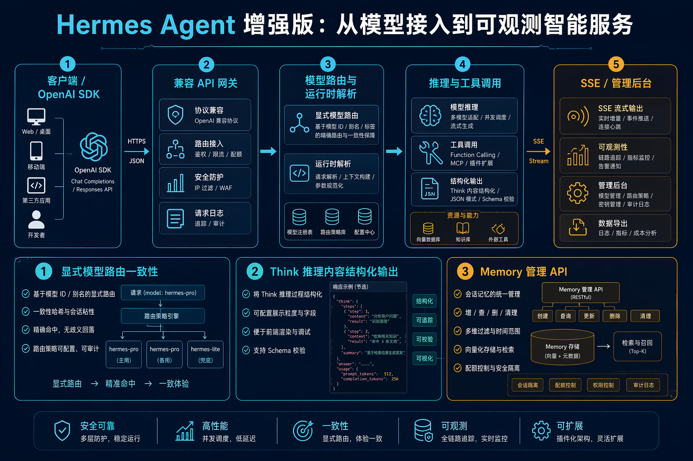
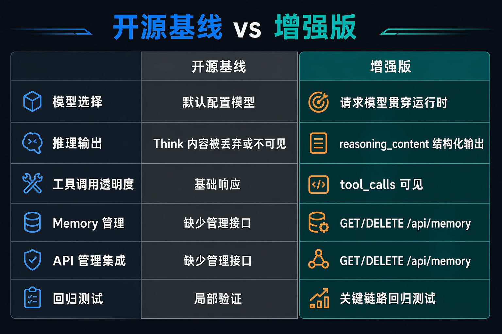
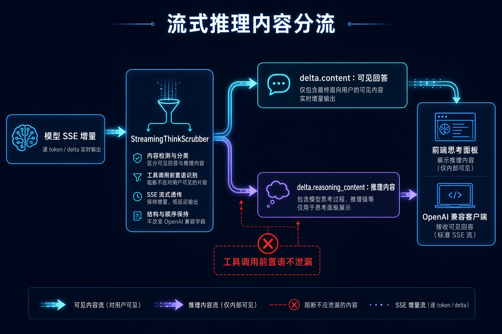

# Hermes Agent 企业版说明

## 一句话说明

> **开源 Hermes 更适合个人使用；企业版让 AI 助手能够安全地服务多人，并成为公司可持续运营的公共能力。**

## 与开源版的核心区别

| | 开源 Hermes | 企业版 |
|---|---|---|
| **服务对象** | 以个人安装、个人使用为主 | 可面向员工、团队和业务系统统一提供服务 |
| **运行环境** | 用户通常共享本机环境与权限 | 每名用户拥有独立 Docker 容器和工作空间 |
| **数据安全** | 安全范围依赖个人电脑配置 | 用户文件、运行过程和资源相互隔离 |
| **资源管理** | 主要管理单个实例 | 可跨多台服务器调度，并限制 CPU、内存和网络访问 |
| **持续使用** | 更适合尝试和个人效率工具 | 支持统一维护、故障处理、升级和规模化推广 |

## 我们解决的三个实际问题

### 1. 从“个人工具”变成“多人 AI 服务”

开源版官方将自身定位为单租户个人 Agent。我们结合 Docker Manager，为每名用户分配独立的 AI 助手实例、访问地址和工作空间，并可在多台服务器间自动调度。

**带来的改变：**

- 员工开通后即可使用，不需要自行安装和配置
- 多人同时使用，互不影响
- 公司统一维护一套平台，减少各部门重复建设
- 新增用户和扩大规模更加简单

### 2. 让 AI 在可控环境中工作

AI 助手不仅回答问题，还会读写文件、运行命令和调用外部服务。企业版把每名用户的 Agent 放入独立 Docker 容器，形成操作系统级边界。

**带来的改变：**

- 用户之间的文件和运行环境相互隔离
- AI 的误操作被限制在当前容器内，降低对服务器和其他用户的影响
- 可限制 CPU、内存和出网范围，避免资源滥用和非授权访问
- 每个工作空间独立保存，容器升级或迁移后仍可继续使用

### 3. 让 AI 真正适合业务使用

我们没有停留在“接入一个大模型”，而是围绕真实使用过程完善了服务入口、模型选择、回答体验和运行保障。

**做出的关键改变：**

- **统一使用入口**：员工和业务系统都能以一致方式使用 AI 能力
- **模型按场景选择**：不同任务可使用更合适的模型，兼顾效果、速度与成本
- **回答更清晰**：整理模型的思考过程和最终答案，减少内部信息干扰用户
- **上下文可延续**：保留独立工作空间和必要记忆，让助手持续理解用户工作
- **运行更稳定**：对模型调用、回答输出和关键流程增加保护，减少中断与异常

## 用户能得到什么

1. **更省事**：无需安装环境、配置模型，开通即可使用。
2. **更安全**：个人文件和操作空间独立，不会与其他用户混在一起。
3. **更好用**：回答更清楚，任务可以连续完成，体验更加一致。
4. **更放心**：AI 可以执行实际工作，但操作范围和资源使用受到控制。
5. **更持久**：更换容器或服务器后，个人工作空间仍可保留。

## 对公司的意义

- 将零散的个人 AI 尝试，转变为可供多人复用的企业公共能力
- 在推广 AI 的同时控制数据、权限、资源和网络风险
- 降低员工使用门槛，加快 AI 在研发、运营、客服和知识管理中的落地
- 统一管理模型与基础设施，减少重复投入，并为后续扩展预留空间

> **最终成果不是多做了几个功能，而是让一个个人 Agent 具备了面向企业多人、安全运行和长期服务的条件。**